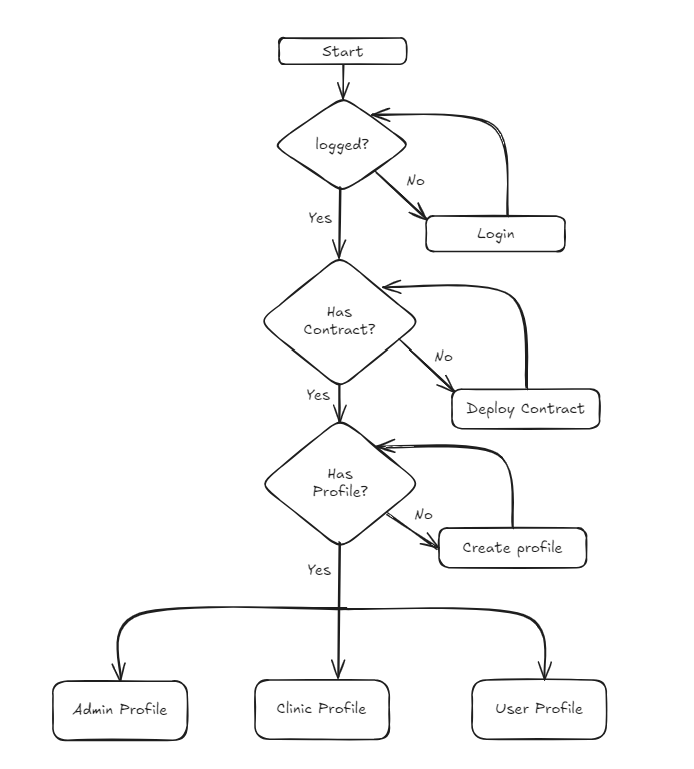
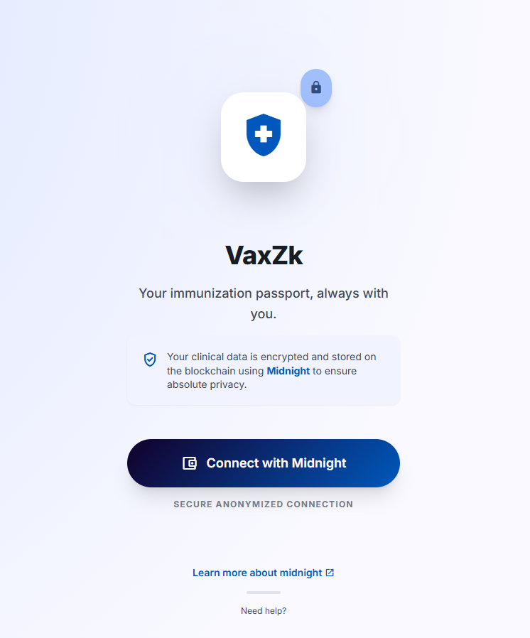

# VaxZK — Privacy-Preserving Vaccine Certificate Manager

VaxZK is a decentralized application (DApp) built on the [Midnight Network](https://midnight.network) that lets health authorities issue vaccine certificates and lets users prove their vaccination status — without ever exposing sensitive personal data.

Certificates are signed off-chain using Schnorr signatures and stored in the user's encrypted private state. When a verifier requests proof, the user submits a zero-knowledge proof on-chain that confirms the certificate is valid and was signed by a registered issuer — without revealing the underlying data.



---

## Table of Contents

1. [What Is VaxZK?](#what-is-vaxzk)
2. [Features](#features)
3. [Technology Stack](#technology-stack)
4. [Deployment & Running the Application](#deployment--running-the-application)
5. [Running the Tests](#running-the-tests)
6. [How Certificates and Proofs Work](#how-certificates-and-proofs-work)

---

## What Is VaxZK?

VaxZK solves a real-world problem: how can a person prove they are vaccinated without handing over a document that reveals their identity, the exact issuer, or other sensitive metadata?

The application uses three roles:

- **Admin** — manages the registry of authorized organizations and vaccine types.
- **Clinic / Authorized Verifier** — issues vaccine certificates and requests proof of vaccination from users.
- **User** — receives certificates, stores them privately, and submits ZK proofs on demand.

All vaccine records remain in the user's local encrypted private state. The public ledger only ever sees the result of a ZK verification — never the raw certificate data.



---

## Features

### Admin

- Invite and revoke other admins using secure one-time invite codes.
- Invite and revoke authorized organizations (clinics, agencies, etc.).
- Manage the global vaccine catalog — add or remove vaccine types.
- Register certificate issuers (e.g. WHO, national health authorities) with their cryptographic public key.
- View platform metrics: total admins, registered clinics, and pending invites.


### Clinic / Authorized Verifier

The "Clinic" role is not limited to traditional health facilities. Any organization with a legitimate need to issue or verify vaccination records can hold this role, including:

- Clinics, pharmacies, and hospitals
- Government immigration agencies (visa processing, entry health screening)
- Border control and customs health units
- Port health authorities and quarantine stations
- Travel health centers and international vaccination registries

Capabilities:

- Create and manage an organization profile (name, location, coordinates).
- Issue Schnorr-signed vaccine certificates to users and deliver the signed proof to their private state.
- Create vaccine proof requests on-chain — specifying the required vaccine type, the user's personal/passport ID, and a minimum certificate validity date.
- View proofs that users have submitted in response to requests.


### User

- Connect via the [Lace](https://www.lace.io/) or [1AM](https://1am.xyz/) browser wallet.
- Browse authorized clinics on an interactive map, filterable by vaccine type and location.
- View private vaccine certificates stored in local encrypted state.
- Submit zero-knowledge vaccine proofs in response to clinic or agency proof requests.
- Multi-language interface: English, Portuguese, and Spanish.


---

## Technology Stack

| Layer | Technologies |
|-------|-------------|
| Frontend | React 19, Vite, TypeScript, Tailwind CSS, React Router 7 |
| Maps & QR | Leaflet / react-leaflet, qrcode.react |
| Reactive state | RxJS |
| Blockchain | Midnight Network (preprod testnet) |
| Smart contracts | Compact language, ZK circuits (10 circuit pairs) |
| Wallet | [Lace](https://www.lace.io/) (Midnight-enabled) or [1AM](https://1am.xyz/) browser extension |
| Build & lint | Vite, ESLint, Vitest |

---

## Deployment & Running the Application

### Prerequisites

- [Node.js](https://nodejs.org/) LTS
- [Midnight Compact compiler](https://docs.midnight.network/getting-started/installation) (`compact`) — required to compile the smart contract
- [Lace wallet](https://www.lace.io/) (with Midnight support enabled) or [1AM](https://1am.xyz/) browser extension

### Development setup

```bash
npm install
npm run contract:compile   # compile the Compact contract and copy ZK assets to public/
npm run dev                # start the Vite dev server
```

Open the URL printed by Vite (typically `http://localhost:5173`) and connect your wallet.

### Re-compiling after contract changes

Whenever any `.compact` file under `contract/` is modified, you must recompile before running or building:

```bash
npm run contract:compile
```

This compiles the Compact source to `contract/managed/` and copies the verifier keys and ZK IR files into `public/keys/` and `public/zkir/`, where Vite serves them as static assets. **Skipping this step after a contract change causes a `ContractConfigurationError` at runtime when the app tries to deploy or call circuits.**

### Available scripts

| Script | Description |
|--------|-------------|
| `npm run dev` | Start the Vite development server with hot reload |
| `npm run build` | Type-check and build for production (output: `dist/`) |
| `npm run contract:compile` | Compile the Compact contract and copy ZK assets to `public/` |
| `npm run contract:copy-assets` | Copy already-compiled ZK assets to `public/` without recompiling |
| `npm run lint` | Lint the codebase with ESLint |
| `npm run format` | Auto-fix lint issues |
| `npm run preview` | Preview the production build locally |

### Production deployment

```bash
npm run build
```

The output in `dist/` is a fully static site. Deploy it to any static host — Vercel, Netlify, AWS S3 + CloudFront, GitHub Pages, etc. No server is required; VaxZK is a client-side DApp.

### Network configuration

The app connects to the Midnight preprod testnet by default. The currently deployed contract address is:

```
927b02ceb1bc3776e87cd5c316b1e43c2a93d6c5b92295f2609c010d1f51a678
```

You can view it at:
`https://preprod.nightforge.jp/address/927b02ceb1bc3776e87cd5c316b1e43c2a93d6c5b92295f2609c010d1f51a678`

---

## Running the Tests

The test suite covers all smart contract circuits using a local simulator — no live Midnight network connection is needed.

```bash
npm run test          # run all tests once
npm run test:watch    # run in watch mode (re-runs on file changes)
```

Tests live in `contract/src/test/`. They use [Vitest](https://vitest.dev/) with a `VaxZkSimulator` that exercises:

- Admin flows (invite, accept, revoke, vaccine catalog)
- Clinic flows (register clinic, issue certificate, create proof request)
- User flows (submit ZK proof, Schnorr signature verification)

Each test has a 15-second timeout because ZK proof generation is compute-intensive even in the simulator.


---

## How Certificates and Proofs Work

### Actors

**Certificate Issuer (Clinic / Authorized Organization)**
Any admin-registered organization that holds an on-chain `CertIssuerInfo` entry containing a JubJub public key (`JubjubPoint`). The organization keeps the corresponding secret key off-chain and uses it to sign vaccine certificates.

**Proof Requester (Clinic / Authorized Verifier)**
An authorized organization that creates a `VaccineProofRequest` on-chain via the `requestVaccineProof` circuit, specifying the required vaccine type, the user's personal/passport ID, and a minimum validity date. Requesters include traditional clinics as well as government immigration agencies, border control and customs health units, port health authorities, quarantine stations, or any body with a legitimate verification need.

**Proof Provider (User)**
The individual who holds a private `VaxZkProof` in their local encrypted state and submits it on-chain via `submitVaccineProof` in response to a proof request.

---

### Certificate issuance flow

```
Admin
  └─ registers Clinic + CertIssuerInfo (with issuer JubJub public key) on-chain

Clinic
  └─ calls signVaxZkCertificate() off-chain (TypeScript)
       │  signs: (vaccine, personalId, expirationDate, userShieldedPubKey)
       │  using: issuer Schnorr secret key
       └─ delivers VaxZkProof to the user's local private state
              (never written to the public ledger)
```

---

### Schnorr signature scheme (JubJub curve)

Certificates are signed using a [Schnorr signature](https://en.wikipedia.org/wiki/Schnorr_signature) over the [JubJub elliptic curve](https://github.com/zkcrypto/jubjub) — a twisted Edwards curve defined over the BLS12-381 scalar field, designed for efficient ZK-circuit arithmetic. JubJub is the same curve used by the [Midnight ZK proofs](https://github.com/midnightntwrk/midnight-zk).

**Signing (off-chain, by the issuer)**

`Compute challenge = H(R, issuerPK, vaccine, personalId, expirationDate, userShieldedPubKey) mod 2^248`

The challenge is truncated to 248 bits because Midnight's `transientHash` returns a value in the BLS12-381 scalar field (~2²⁵⁵), which can exceed the JubJub subgroup order (~2²⁵²·⁴). The truncation is performed with a witness-assisted division inside the ZK circuit (`getSchnorrReduction`), where the circuit proves `q·2^248 + r = cFull` with `r < 2^248`.

**Verification (inside the ZK circuit, on-chain)**

The circuit (`schnorrVerifyVaxZk` in `contract/Schnorr.compact`) performs this check natively using Compact's `ecMulGenerator`, `ecMul`, and `ecAdd` built-ins. If the equation holds, the certificate is valid.

---

### Proof submission & on-chain verification flow

```
Clinic
  └─ requestVaccineProof(vaccine, personalId, validUntil)
       └─ writes VaccineProofRequest to public ledger  →  proofReqId

User
  └─ submitVaccineProof(proofReqId)
       │  reads VaxZkProof from local private state (via witness)
       │  ZK circuit checks:
       │    1. proof.issuerId is registered in issuers map
       │    2. proof.vaccine  == request.vaccine
       │    3. proof.personalId == request.personalId
       │    4. proof.expirationDate >= request.validUntil
       │    5. schnorrVerifyVaxZk(…) — Schnorr equation holds
       └─ writes VaxZkProof to vaccineProofs[proofReqId] on public ledger
              (raw certificate data never exposed)
```

---

### Privacy model

| Data | Where it lives | Visible to verifier? |
|------|---------------|----------------------|
| Raw vaccine certificate (vaccine type, issuer, expiration, personal ID) | User's local encrypted private state | No |
| Issuer public key | Public ledger (`issuers` map) | Yes |
| Proof request parameters | Public ledger (`vaccineProofReqs` map) | Yes |
| ZK proof result | Public ledger (`vaccineProofs` map) | Yes (proof only) |
| User identity / wallet address | Shielded via `persistentHash` | No |

Shielded IDs are derived as `persistentHash("registered-entity-id:" ‖ publicKey)`, so on-chain identifiers cannot be traced back to raw public keys without the preimage.
